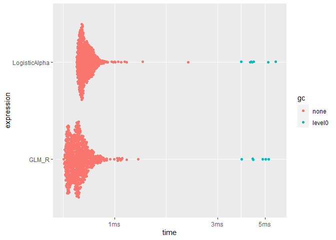

R Package for Binary Logistic Regression Analysis
================
BulunTe


<!-- badges: start -->
[](https://github.com/petercrimson2023/LogisticAlpha/actions/workflows/R-CMD-check.yaml)

[](https://app.codecov.io/gh/petercrimson2023/LogisticAlpha?branch=Master)

[](https://github.com/petercrimson2023/LogisticAlpha/actions/workflows/R-CMD-check.yaml)
<!-- badges: end -->


This R package provides a set of functions for performing logistic
regression analysis, including computation of logit values, logistic
prediction, and logistic regression estimation. It is designed for users
who need robust and efficient tools for statistical analysis in R.

## Functions Included

1.  **`Logit`**: Calculates logit values based on input matrix `X` and
    coefficient vector `beta`. Handles extreme values in the
    exponentiation to avoid computational errors.

2.  **`Diagonol_Multiply`**: Performs a diagonal multiplication of a
    matrix `X` and a vector `W`, useful in logistic regression
    calculations.

3.  **`Logistic_Predict`**: Predicts outcomes using the logistic model.
    Takes a matrix `X`, coefficient vector `Beta`, and a threshold
    `thre` to return predictions.

4.  **`Logistic_Estimation`**: Estimates logistic regression parameters
    using the Newton-Raphson method. It returns a comprehensive list of
    results including coefficients, confusion matrix, Fisher Information
    Matrix, and more.

## Usage

### Sample data

``` r
set.seed(123)
X = matrix(rnorm(100), ncol=2)
y = rbinom(50, 1, 0.5)
```

### Logistic Regression Estimation

``` r
library("LogisticAlpha")
result = Logistic_Estimation(X, y)
```

#### View results

``` r
print(result$Coefficients)
```

    ##              Estimate   Std_Err     Z_Score         p
    ## Intercept -0.01498098 0.2909321 -0.05149306 0.9589326
    ## Var_1      0.38449206 0.3209556  1.19796031 0.2309325
    ## Var_2      0.01635202 0.3187836  0.05129504 0.9590904

## Installation

### Using devtools::install_github()

``` r
install.packages("devtools")
```

    ## Installing package into 'C:/Users/AltanGadasTbl/AppData/Local/Temp/Rtmp0EOTUZ/temp_libpath8db05fdd28c5'
    ## (as 'lib' is unspecified)

    ## package 'devtools' successfully unpacked and MD5 sums checked
    ## 
    ## The downloaded binary packages are in
    ##  C:\Users\AltanGadasTbl\AppData\Local\Temp\RtmpGEkNSV\downloaded_packages

``` r
library(devtools)
```

    ## Warning: package 'devtools' was built under R version 4.3.2

    ## Loading required package: usethis

``` r
install_github("https://github.com/petercrimson2023/LogisticAlpha/",ref="Master")
```

    ## Downloading GitHub repo petercrimson2023/LogisticAlpha@Master

    ## ── R CMD build ─────────────────────────────────────────────────────────────────
    ##          checking for file 'C:\Users\AltanGadasTbl\AppData\Local\Temp\RtmpGEkNSV\remotes19b46c481781\petercrimson2023-LogisticAlpha-38d25cf/DESCRIPTION' ...  ✔  checking for file 'C:\Users\AltanGadasTbl\AppData\Local\Temp\RtmpGEkNSV\remotes19b46c481781\petercrimson2023-LogisticAlpha-38d25cf/DESCRIPTION'
    ##       ─  preparing 'LogisticAlpha':
    ##    checking DESCRIPTION meta-information ...     checking DESCRIPTION meta-information ...   ✔  checking DESCRIPTION meta-information
    ##       ─  checking for LF line-endings in source and make files and shell scripts
    ##   ─  checking for empty or unneeded directories
    ##      Omitted 'LazyData' from DESCRIPTION
    ##       ─  building 'LogisticAlpha_0.1.0.tar.gz'
    ##      
    ## 

    ## Warning: package 'LogisticAlpha' is in use and will not be installed

### Checking For Help on Functions

``` r
library(LogisticAlpha)

?Logistic_Estimation

?Logistic_Predict

?Logit
```

### Comparison to the glm() function

``` r
library(tidyr)
library(bench)
```

    ## Warning: package 'bench' was built under R version 4.3.2

``` r
set.seed(1)

X1 <- matrix(rnorm(20), ncol=2)
y1 <- rbinom(10, 1, 0.5)

benchmark = bench::mark(
  LogisticAlpha = as.vector(Logistic_Estimation(X1, y1)$Coefficients$Estimate),
  GLM_R = as.vector(coef(glm(y1~X1, family = "binomial"))),
  min_iterations = 100
)

plot(benchmark)
```

<!-- -->
